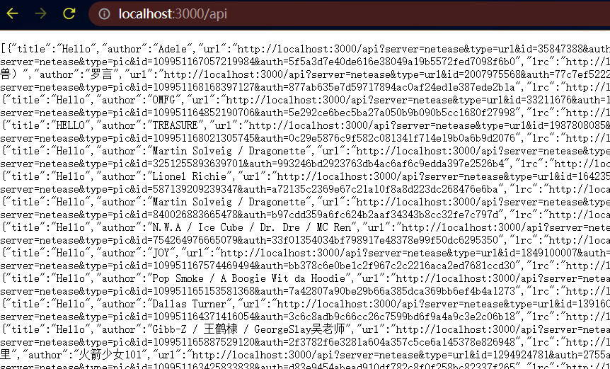

# Meting-API

## 写在前面

Meting后端的api结构较为复杂，基础是一个[接口](https://github.com/metowolf/Meting/blob/master/src/Meting.php)，原作者在此基础上增加了[php后端](https://github.com/metowolf/Meting-API/blob/master/api/root/var/www/meting/public/index.php)，又用node做了一层[wrapper](https://github.com/metowolf/Meting-API/tree/master/server)。

同时可以发现原作者在docker hub上传了php后端的[镜像](https://hub.docker.com/r/metowolf/meting)，但没有node的镜像（仓库中仍有Dockerfile）。

原作者大佬的api服务可能不太稳定，于是我在上面两个Dockerfile的基础上新生成了单一的Dockerfile，仅仅对外暴露一个3000端口。并且微改了一些代码，适配了vercel的serverless function。

## 部署

部署 Meting-API 需要基本的计算机编程常识，如果您在部署过程中遇到无法解决的问题请到 issues 向我们提问，我们会尽快给您答复。

如果部署成功，在你的域名后拼接上`/api`，理论上出现类似下图数据：



### 手动部署

由于该项目既有php又有node，且原来代码各层级之间的api关系不太清晰，这里不建议手动部署。

### Docker部署

运行下面的命令下载 Meting-API 镜像

```
docker pull intemd/meting-api:latest
```

然后运行 Meting-API 即可

```
docker run -d --name meting -p 3000:3000 intemd/meting-api:latest
```

在浏览器中打开 http://localhost:3000/api 来进行测试 ✅

### 部署到vercel

<a href="https://vercel.com/import/project?template=https://github.com/xizeyoupan/Meting-API"></a>

由于ip不在大陆，可能会有版权等问题，未详细测试。

## 使用

在导入[前端插件](https://github.com/metowolf/MetingJS)前，加入

```
<script>
var meting_api='http://example.com/api?server=:server&type=:type&id=:id&auth=:auth&r=:r';
</script>
```

比如

```
<script>
var meting_api='http://localhost:3000/api?server=:server&type=:type&id=:id&auth=:auth&r=:r';
</script>
```

即可。就这样吧，那我去看vtb了，88
